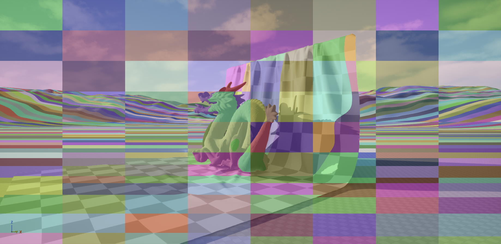
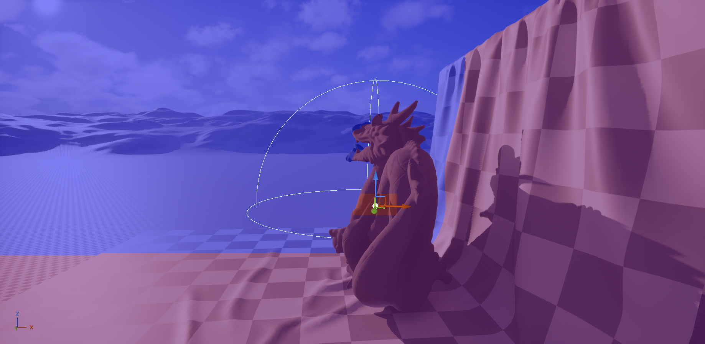

# UE5 Froxel Lighting Plugin

A real-time **clustered (froxel) lighting and volumetrics system** for Unreal Engine 5.  
Built as a C++/HLSL plugin with Render Graph integration.


## Features (Roadmap)
- [x] Froxel grid builder (frustum voxel partitioning).
- [x] Compute shader for per-froxel light assignment.
- [x] GPU light buffer with SoA (structure of arrays) layout.
- [x] Debug heatmap overlay for froxel occupancy.
- [ ] Cascaded shadow maps + shadow atlas visualization.
- [ ] Temporal AA with reactive mask fixes.
- [ ] Volumetric fog with temporal reprojection.
- [ ] Screen-space reflections (scalability tiers).
- [ ] In-engine performance HUD (FPS, draw calls, light count).

### Goal
- Demonstrate modern real-time rendering techniques in UE5.
- Benchmark performance across Apple M3 (Metal) and RTX 3060 (DX12).

### Process Overview
1. **Froxel Grid Construction**: Partition the camera frustum into a 3D grid of froxels (frustum voxels).
2. **Per Froxel Light Assignment**: For each light in the scene, determine which froxels it affects using compute shaders.
   1. **Light Counting**: Count the number of visible lights affecting each froxel and store this in a structured buffer. (See `FroxelCount.usf`)
   2. **Buffer Offsets**: Create a buffer of offsets to index into the light list for each froxel."
      1. Blelloch scan (prefix sum) to compute offsets in each Z-slice. (See `FroxelOffsetPassA.usf`)
      2. Blelloch scan across Z-slices to get final offsets. (See `FroxelOffsetPassB.usf`)
      3. Add a final offset to each froxel to get absolute indices. (See `FroxelOffsetPassC.usf`)
3. **Light Assignment**: For each froxel, assign the indices of lights affecting it.
   1. Reduce pass to compute the total number of light assignments. (See `FroxelTotalIndices.usf`)
   2. Use atomic operations to safely write light indices into the froxel's light list. (See `FroxelAssignLights.usf`)
4. **Debug Overlay**: Render a heatmap overlay showing froxel occupancy and light counts for debugging purposes. (See `FroxelOverlayHash.usf`, and `FroxelOverlayHeatmap.usf`)
5. TODO: Implement lighting and volumetric effects using the froxel data.

### Screenshots
| Froxel Grid Visualization                   | Froxel Light Count Heatmap (WIP)                  |
|---------------------------------------------|---------------------------------------------------|
|  |  |

### Applied Technologies
- C++20
- Unreal Engine 5.6+
- Render Graph API
- Slate UI Framework for in-engine HUD
- HLSL Compute and Pixel Shaders
- GPU Profiling Tools (Unreal Insights, Xcode GPU Frame Capture, RenderDoc)
- Git for version control

### License
MIT — free to use, modify, and share.

## Build Instructions
1. Clone this repo into your UE5 project’s `Plugins/` directory:
   ```bash
   git clone https://github.com/ArminTajik/ue5-froxel-lighting Plugins/FroxelLighting